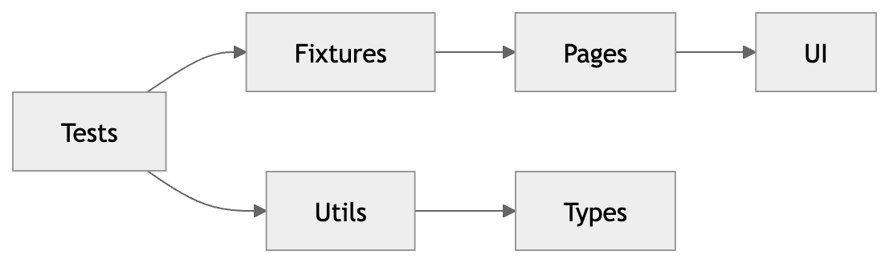
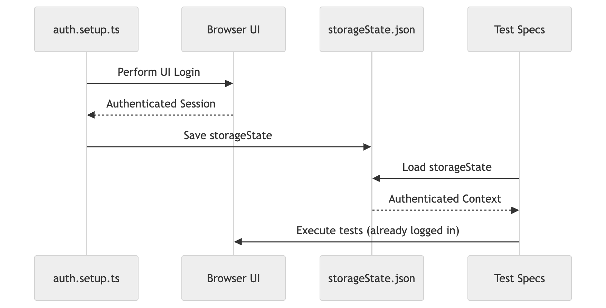

# 📚 Playwright Book Store Automation Framework


A **Playwright + TypeScript** automation framework built using **Page Object Model (POM)**, fixtures, and session-based authentication.

---

## 🚀 Getting Started

### 1. Install dependencies
```bash
npm install

2. Install Playwright browsers
npx playwright install

3. Run tests

npx playwright test

⚙️ Environment Configuration
Create a .env file in the root directory:

BASE_URL=https://demoqa.com
USERNAME=book_store123
PASSWORD=BookStore@123
USERID=bf478f5f-114b-4fff-a1e3-cc86c6cef051

🧱 Framework Architecture
The framework follows Page Object Model (POM) and clean separation of concerns.
📊 High-Level Architecture



🔐 Authentication Flow



📁 Folder Structure Overview
.
├── fixtures/
│   └── auth-fixture.ts
├── pages/
│   ├── bookDetailsPage.ts
│   ├── bookStorePage.ts
│   ├── loginPage.ts
│   └── profilePage.ts
├── tests/
│   ├── auth.setup.ts
│   ├── bookstore.spec.ts
│   ├── login.spec.ts
│   └── profile.spec.ts
├── utils/
│   ├── apiLogin.ts
│   ├── bookInterface.ts
│   └── constants.ts
├── playwright/.auth/
│   └── user.json
├── playwright.config.ts
├── .env
└── README.md

🧩 Key Components
🔹 Page Object Model (POM)
All UI interactions are encapsulated in pages/
Each page contains:
locators
actions
reusable methods

🔹 Fixtures
Located in fixtures/auth-fixture.ts
Used to inject dependencies like page
Keeps tests clean and reusable

🔹 Tests
Located in tests/
Focus only on test logic and assertions
Use page classes for actions

🔹 Utils
constants.ts → Enums and static values
bookInterface.ts → Type-safe API models

🔐 Authentication Strategy
This framework uses Playwright setup project (auth.setup.ts) for authentication.

How it works:
auth.setup.ts runs first
Performs UI login
Saves session → playwright/.auth/user.json
All other tests reuse this session

🧪 Test Types

🔹 Authenticated Tests
Run with saved session
Skip login
Faster execution

🔹 Login Tests
Run separately
No stored session
Validate:
valid login
invalid login

🧹 Test Cleanup
Books added during tests are removed via afterEach
Ensures:
clean state
repeatable runs

🛠️ Commands
Run all tests
npx playwright test
Run authenticated tests only
npx playwright test --project="Book Store"
Run login tests only
npx playwright test --project=login
Run headed
npx playwright test --headed

📊 Reports
npx playwright show-report

Report location:
playwright-report/

Best Practices Implemented
✅ Page Object Model (POM)
✅ TypeScript typing
✅ API + UI validation
✅ Auth session reuse
✅ Clean architecture
✅ Test isolation
✅ Stable locators
